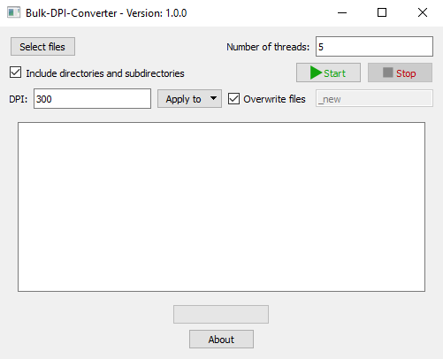

# Description
Bulk-DPI-Converter is a software for changing the resolution of multiple image files.

### Motive
For some applications (like DTF printing), one should increase the resolution of images, and doing it one image at a time can be time consuming.

## Usage
1. [Download](https://github.com/ItaiShek/Bulk-DPI-Converter/releases/download/v1.0.0/Bulk_DPI_Converter.exe) the executable.
2. Choose files/directories.
3. Set the desired DPI value.
4. Press the `start` button.

